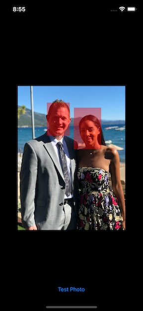
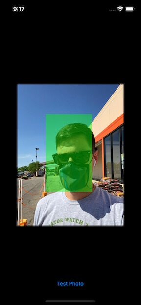
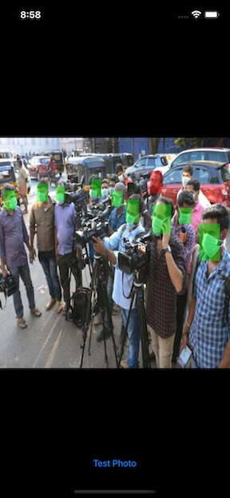
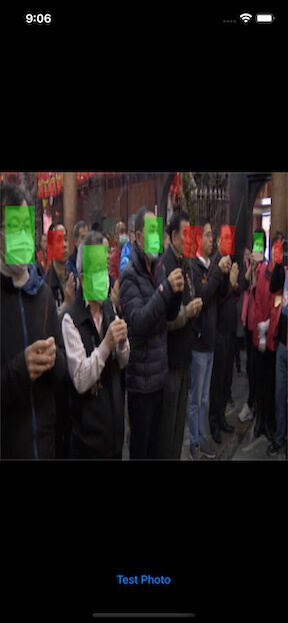
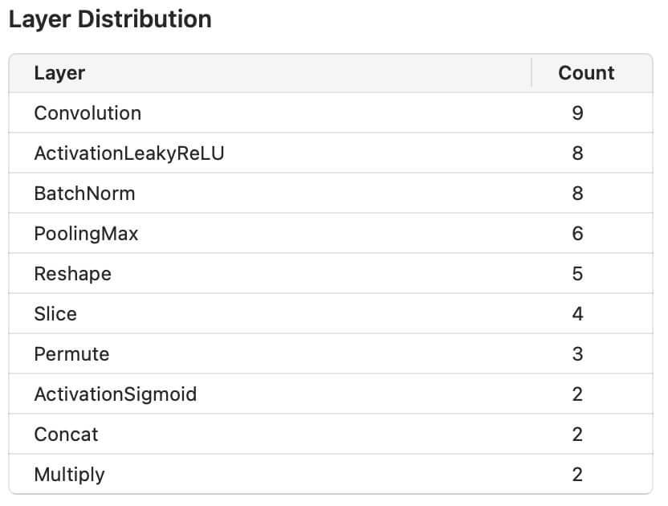
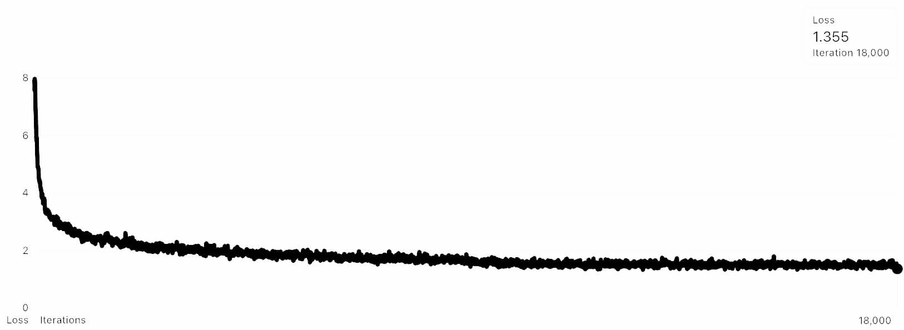
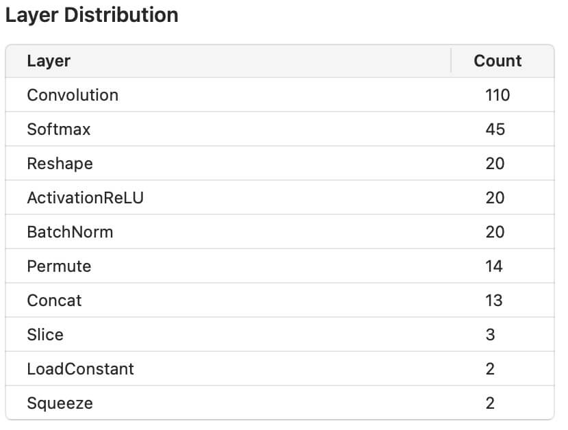
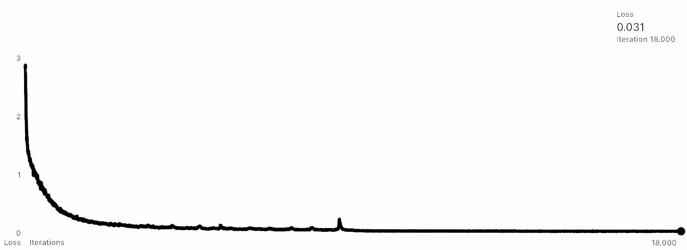

# Mask Detection With Computer Vision

### Overview
Mask wearing is a simple and powerful way to combat COVID, but it is most effective when practiced at scale within populations. Unfortunately mask wearing has become politicized in the United States, and businesses are often in the position of policing and enforcing mask wearing themselves.

Enter the [COVID Bouncer](https://github.com/eric-pierce/COVID-Bouncer) - an application which can be used to detect mask wearing without needing to put a real person at risk of exposure. When paired with a door lock, the COVID Bouncer can detect the presence of face masks before allowing entry into a business.

The Bouncer is able to identify people not wearing masks as well as those wearing masks:

 

It also functions with images that include multiple subjects as can be seen in the examples below:

 

### Tools Used
This project was built using Apple's development stack, including their [CreateML](https://developer.apple.com/machine-learning/create-ml/) framework.
* The only tools required to use this repository is ther XCode suite, which includes CreateML.
* [Roboflow](https://roboflow.com/) was used during the data preparation phase.

### Data Acquisition
The data for this project came from two sources - one dataset compiled on [kaggle](https://www.kaggle.com/) and one compiled by the [Roboflow](https://www.roboflow.com/). Both of these datasets consist of images of people wearing masks and people not wearing masks. Some images include a mix of mask wearing and non-wearing individuals. The Kaggle dataset also included incorrectly worn masks, but those were removed due to low data availability.
* [Kaggle Mask Detection Dataset](https://www.kaggle.com/andrewmvd/face-mask-detection)
* [Roboflow Mask Wearing Dataset](https://public.roboflow.com/object-detection/mask-wearing).

### Data Preparation
These datasets required some modification to align labels, and to convert from their respective formats to one which Apple's CreateML expects.
* Modify the annotations to use "with_mask" and "without_mask" as labels
* Remove the "mask_weared_incorrect" label from the kaggle dataset
* Convert annotation component of both datasets from Pascal VOC XML to Apple's CreateML JSON

I used a 70/20/10 split for train/test/validation for this dataset. The final dataset consisted of:
* 698 training images
* 199 testing images
* 100 validation images

### Model Architecture
I evaluated two training methods as part of this model development. Both models were trained for 18,000 iterations, which took ~14 hours per model. I used [loss as an evaluation measure](https://developers.google.com/machine-learning/crash-course/descending-into-ml/training-and-loss) for both models, which is an indicator of how far off from correct prediction a model is for a single example.

First I trained a Full Network (non-Transfer Learning) with an architecture based on YOLOv2:

The Full Network training results are below, and resulted in a loss of 1.355

Second I trained a Transfer Network based on Apple's "Object Vision Feature Print":

The Transfer Network training results are below, and resulted in a loss of 0.31

### Deployment
I used my personal iPhone as my Edge Device. Modern iPhones include a specialized chip for Neural Network processing. I built my iPhone app using a framework available on [GitHub here](https://github.com/tombaranowicz/ObjectDetectionWithCreateML). This framework was an excellent starting point, but I modified the application code to:
* Use the custom model I trained instead of the roadsign detector
* Only highlight objects detected when there is a > 90% accuracy
* Not allow for objects to overlap with each other (ie no detection of both mask wearing and non-mask-wearing)
* Highlight masks in Green, and non-masks in Red

### Roadblocks
I ran into some issues with my personal phone not functioning correctly. The app I built functioned as expected in the iOS simulator, as well on older iPhones such as the iPhone X. I expect that this has to do with the camera on the new phones capturing images in a different format.

### Next Steps
Next steps for this project are to apply it to live video as opposed to still images. I've already developed an application which does this using the [Breakfast Detector](https://developer.apple.com/documentation/vision/recognizing_objects_in_live_capture) example written by Apple. I'm not satisfied with the results of this yet.

From a modeling architecture standpoint there is absolutely opportunity to increase accuracy. The simplest way to do this is to procure and train using more data. The dataset I have doesn’t have balanced examples of masks vs no-masks. Fortunately the gap is primarily on the non-mask class, and there are several datasets available which can be merged with my current dataset for a more balanced input.

